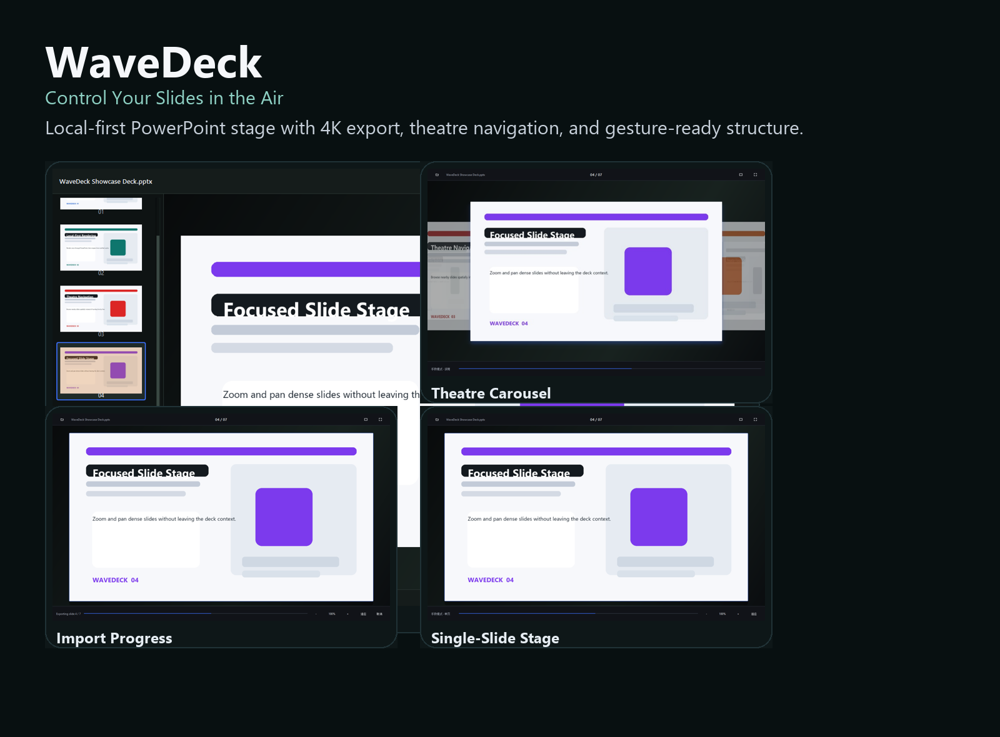
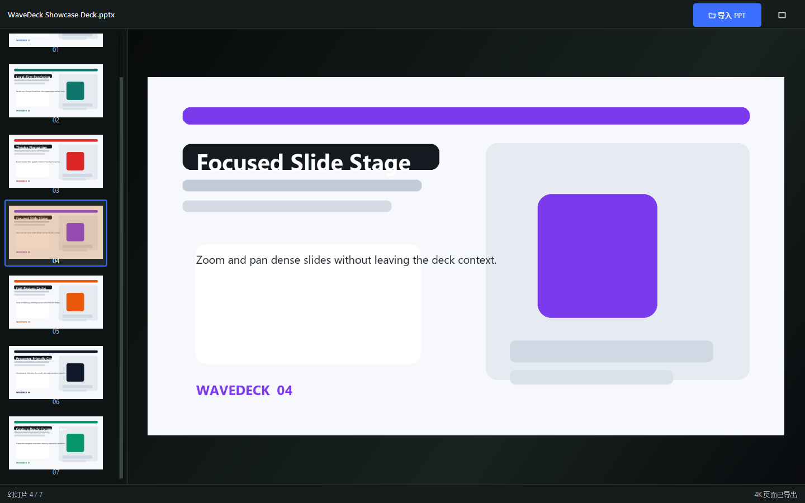
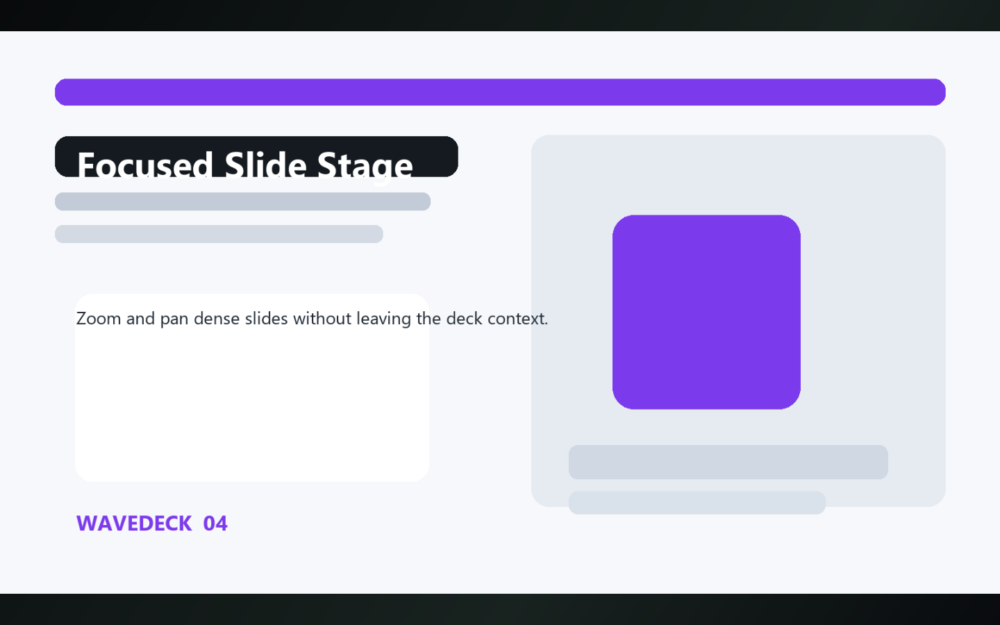
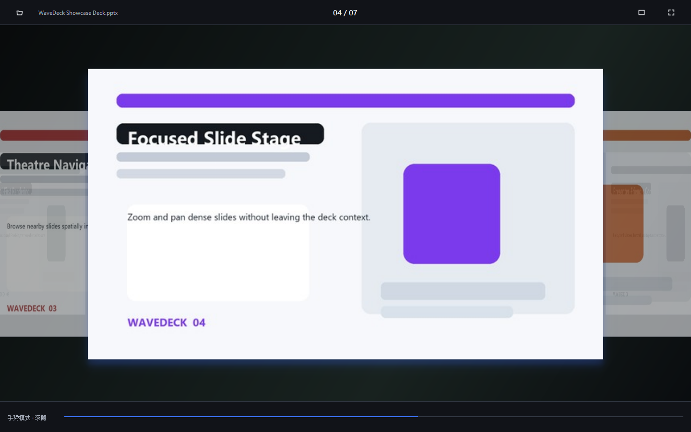
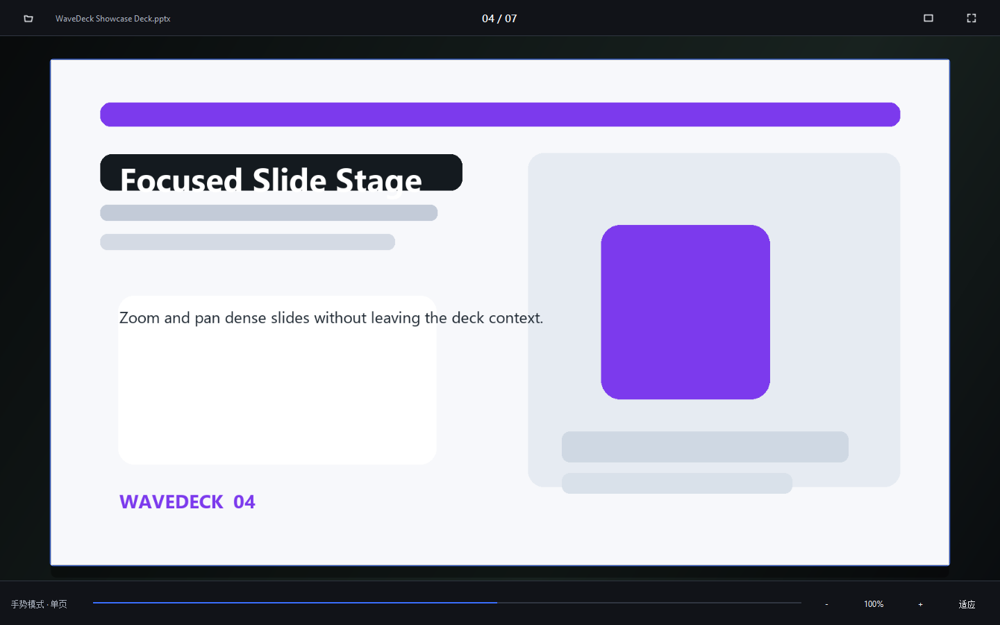
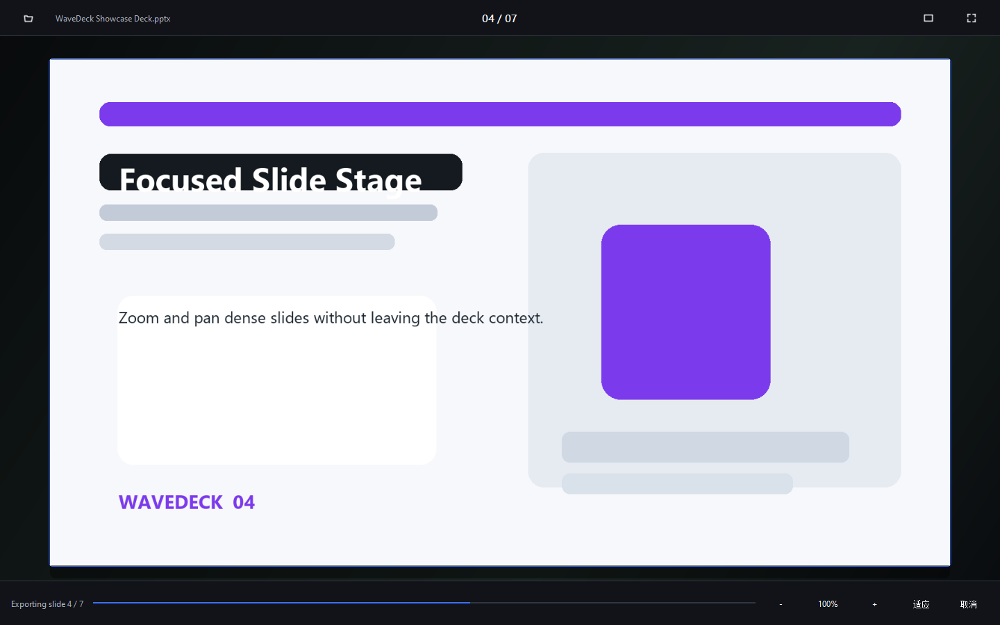

# WaveDeck - Control Your Slides in the Air

[](https://github.com/LLK-LL/textwavedeck/releases)
[](https://github.com/LLK-LL/textwavedeck/stargazers)
[](https://github.com/LLK-LL/textwavedeck/blob/main/LICENSE)
[](https://github.com/LLK-LL/textwavedeck)
[](https://www.python.org/)

[中文说明](README.zh-CN.md) · [Release Notes](docs/release-v0.1.0.md) · [Privacy Notes](docs/security-and-privacy.md)

WaveDeck is a local-first PowerPoint stage for Windows. It turns existing `.ppt` and `.pptx` files into crisp 4K slide images, a theatre-style preview wall, a distraction-free slideshow surface, and a gesture-ready navigation workspace.

> Your deck stays local. The app does the heavy rendering once, caches it safely, and lets you move through slides like a presentation studio instead of a file viewer.



## What It Does

- Imports existing PowerPoint decks without changing the source file.
- Uses Microsoft PowerPoint COM for faithful PNG export.
- Caches rendered slides locally for fast reopen.
- Offers three presentation surfaces:
  preview with thumbnails, full-slide slideshow, and a five-page theatre carousel.
- Supports mouse, keyboard, fullscreen, zoom, pan, and page-jump workflows.
- Keeps the rendering pipeline local and avoids uploading deck contents anywhere.

## Why This Exists

Most slide tools force a tradeoff:

- PowerPoint gives fidelity, but the browsing experience feels heavy.
- Image viewers feel fast, but they lose PowerPoint compatibility and context.
- Camera-first gesture demos look flashy, but often ignore the deck-reading experience itself.

WaveDeck starts from the opposite direction: make the slide stage feel premium first, then build gesture control on top of a clean local navigation core.

## Before / After

| Before | With WaveDeck |
| --- | --- |
| Reopen a large deck and wait for PowerPoint every time | Export once, reopen from validated local cache |
| Jump between edit view and slideshow | Switch between preview, slideshow, and theatre carousel |
| Thumbnail browsing feels cramped | Use a dedicated left rail plus a clean full-slide stage |
| Presentation UI and media UI mix together | Keep a dark, focused stage around the original slide colors |

## Screenshots

The public screenshots focus on the slide experience only and intentionally exclude any camera feed.











## Core Highlights

- Faithful PowerPoint export: slides are rendered through PowerPoint itself, not a best-effort parser.
- 4K-ready cache: 16:9 decks export to `3840x2160`, 4:3 decks to `3840x2880`, with atomic cache replacement.
- Dark theatre UI: the app keeps the slide untouched while surrounding it with a focused graphite-green stage.
- Five-page cylinder carousel: the centered page stays dominant while nearby pages remain visible for spatial navigation.
- Local-first privacy: no upload step, no PPT content logged, no forced cloud service.
- Gesture-ready architecture: stage commands are already abstracted so the next interaction layer can target the same navigation core.

## Quick Start

### Requirements

- Windows 10 or Windows 11
- Python 3.11
- Microsoft PowerPoint 2016 or later

### Install

```powershell
python -m venv .venv
.venv\Scripts\python.exe -m pip install -r requirements.txt
```

If the default PyPI route is slow on your network:

```powershell
.venv\Scripts\python.exe -m pip install -i https://pypi.tuna.tsinghua.edu.cn/simple -r requirements.txt
```

### Launch

```powershell
启动手势控制PPT.cmd
```

Or:

```powershell
.venv\Scripts\python.exe main.py
```

## Example Flow

1. Open a `.ppt` or `.pptx` file.
2. Let WaveDeck export the deck into a validated local cache.
3. Review pages in preview mode with the thumbnail rail.
4. Double-click into slideshow mode for a clean single-slide view.
5. Press `Ctrl+Alt+M` to enter the theatre carousel and pick slides spatially.

See [examples/quick-start.md](examples/quick-start.md) and [examples/presentation-modes.md](examples/presentation-modes.md) for a more guided walkthrough.

## Keyboard And Interaction

- `Ctrl+O`: open a PowerPoint file
- `Ctrl+Alt+M`: switch between PPT mode and theatre mode
- `PageDown`, `Right`, `Space`, `N`: next slide
- `PageUp`, `Left`, `P`: previous slide
- `Home`, `End`: first or last slide
- `F11`: toggle fullscreen
- `Esc`: leave fullscreen or return from stage to carousel
- Mouse wheel in stage mode: zoom
- Mouse drag in stage mode: pan or swipe between pages depending on context

## Repository Layout

```text
app/        Main window, theme, workers, navigation bindings
gesture/    Experimental gesture runtime and diagnostics
models/     Slide project and page metadata
ppt/        PowerPoint export, cache, and project persistence
tests/      Unit tests plus Windows visual / COM smoke coverage
widgets/    Preview workspace, carousel, stage viewer, overlays
docs/       Release notes, privacy notes, architecture, screenshots
examples/   Guided usage scenarios
```

## Safety And Privacy

- Slide rendering happens on the local machine.
- Source PPT contents are not written to logs.
- Cache replacement is atomic to avoid corrupting a healthy export.
- The app does not auto-install PowerPoint, Python, or third-party packages.

Read the full notes in [docs/security-and-privacy.md](docs/security-and-privacy.md).

## Project Status

`v0.1.0` is the public launch release.

What is stable now:

- PowerPoint import and 4K export
- Local cache validation
- Preview, slideshow, carousel, and single-slide stage
- Keyboard and mouse navigation
- Fullscreen and reduced-motion support

What is still evolving:

- Gesture control defaults and ergonomics
- Packaging beyond source checkout
- More polished diagnostics and onboarding

## Roadmap

- Improve release packaging for non-developer users
- Refine gesture controls without making camera visuals part of the default presentation UI
- Add more sample decks and showcase workflows
- Expand automated visual verification

## Contributing

Contributions are welcome, especially around Windows UX, PowerPoint fidelity, caching, testing, and packaging.

Before opening a PR:

- read [CONTRIBUTING.md](CONTRIBUTING.md)
- avoid uploading private decks, secrets, or customer material
- keep README and screenshot claims aligned with real behavior

## One-Sentence Summary

WaveDeck makes local PowerPoint decks feel like a presentation-native stage instead of a document you happen to scroll through.
