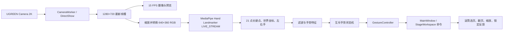

# 手势控制 PPT：第二阶段执行方案

> 方案日期：2026-07-14  
> 目标平台：当前 Windows 电脑  
> 核心方案：Google MediaPipe Hand Landmarker + OpenCV + PySide6

## 1. 阶段目标

在已经完成的第一阶段 PPT 图片浏览器上增加本地实时手势控制，并保持现有 PPT 导入、缓存、滚筒选页、单页舞台、缩放、翻页、全屏和键盘能力不变。

第二阶段交付以下手势：

- 摄像头实时画面与 21 点手部关键点反馈
- 食指指针移动
- 拇指与食指捏合选择
- 单手左右挥动翻页
- 双手距离控制页面放大、缩小
- 握拳锁定、解锁手势

所有识别在本机完成，不上传摄像头画面，不保存视频帧，不把图像或关键点写入日志。

## 2. 本机硬件结论

### 2.1 已检测硬件

| 项目 | 本机信息 | 对方案的影响 |
|---|---|---|
| CPU | Intel Core i7-12700，12 核 20 线程 | 足以承担双手 Hand Landmarker 实时推理，默认走 CPU |
| 内存 | 31.79 GB | 摄像头、PPT 图片缓存和模型可同时运行，无需额外内存限制 |
| 独立显卡 | NVIDIA GeForce GTX 1070 Ti，8 GB，驱动 582.28 | 继续用于桌面和 Qt 图形合成；不作为 Windows Python MediaPipe 的必选推理后端 |
| 集成显卡 | Intel UHD Graphics 770 | 可承担系统桌面合成，但不参与本阶段 Hand Landmarker 推理 |
| 摄像头 | UGREEN Camera 2K，设备状态正常 | 使用 DirectShow + MJPG，默认采集 1280×720 |
| 当前显示分辨率 | 1920×1080 | 指针按窗口实际尺寸动态映射，不硬编码屏幕坐标 |
| Python | 3.11.15 | 符合 MediaPipe Python 3.9+ 要求 |

系统中还存在 ToDesk 和 GameViewer 虚拟显示适配器。手势坐标必须映射到当前应用窗口，而不是按显示适配器数量推断桌面范围，避免远程软件导致坐标偏移。

### 2.2 摄像头实测

使用 OpenCV DirectShow、MJPG、目标 30 FPS 进行短时采样：

| 请求模式 | 实际模式 | 实测采集帧率 |
|---|---|---:|
| 640×360 @ 30 | 640×480 | 约 25.4 FPS |
| 1280×720 @ 30 | 1280×720 | 约 25.4 FPS |
| 2560×1440 @ 30 | 2560×1440 | 约 25.5 FPS |

结论：

- 不使用 2K 画面直接推理。2K 没有提高实际帧率，只会增加颜色转换、缩放和内存带宽开销。
- 摄像头默认采集 `1280×720`，保留 16:9 画面用于预览。
- 推理前缩小为 `640×360`，目标推理吞吐设为 `25 FPS`。
- 摄像头返回约 25 FPS，因此不建立 30 FPS 帧队列，避免排队产生越来越大的延迟。

## 3. GPU 与推理后端决策

Google 官方文档明确说明 Linux 桌面在支持 OpenGL ES 3.1+ 的显卡上可以运行 MediaPipe GPU 计算和 TFLite GPU 推理，但没有给出 Windows Python Hand Landmarker GPU 路径的同等支持承诺。

因此本项目默认采用：

```text
MediaPipe Python Tasks + CPU delegate + LIVE_STREAM
```

这不是硬件能力不足，而是当前技术栈下最稳定、开发量最小且可打包的路径。i7-12700 足以运行双手检测；强行依赖 GTX 1070 Ti GPU delegate 会引入 Windows wheel、OpenGL/CUDA 构建和部署不确定性。

GPU 的实际作用：

- GTX 1070 Ti 继续承担 Windows/Qt 界面合成。
- PPT 舞台和 60 Hz 指针动画保留在 Qt 图形层。
- OpenCV 不启用 CUDA，也不在 CPU/GPU 间反复复制摄像头帧。

只有未来迁移到原生 C++ MediaPipe、Linux 或经过单独验证的 GPU 构建时，才增加 GPU 推理分支。本阶段不得让 GPU 初始化失败影响基础 PPT 浏览能力。

## 4. 最终运行参数

| 参数 | 默认值 | 原因 |
|---|---:|---|
| 摄像头后端 | `cv2.CAP_DSHOW` | Windows 上启动和设备选择更可控 |
| 摄像头设备 | `UGREEN Camera 2K` / index 0 | 当前唯一正常摄像头 |
| 摄像头格式 | MJPG | 降低 USB 带宽压力 |
| 采集分辨率 | 1280×720 | 真实 16:9，预览清晰，开销低于 2K |
| 请求帧率 | 30 FPS | 设备实际约 25 FPS，保留兼容设置 |
| 推理分辨率 | 640×360 | 对手部关键点足够，减少预处理开销 |
| 推理模式 | `LIVE_STREAM` | 异步返回，忙时自动忽略新帧，不阻塞 UI |
| 最大手数 | 2 | 双手缩放必须检测两只手 |
| 手部检测置信度 | 0.55 | 降低背景误检，同时保留重新捕获速度 |
| 手部存在置信度 | 0.50 | 避免轻微遮挡就频繁重新做掌部检测 |
| 跟踪置信度 | 0.50 | 保持官方默认平衡，减少重复掌部检测 |
| 关键点目标吞吐 | 20~25 FPS | 与摄像头实测能力匹配 |
| 摄像头小窗刷新 | 15 FPS | 降低 Qt 图片上传开销，关键点仍按 25 FPS 处理 |
| 指针绘制 | 60 Hz | 在两次关键点结果之间做短插值，视觉更平滑 |
| 页面翻转冷却 | 700 ms | 防止一次挥手连续翻多页 |
| 选择冷却 | 300 ms | 防止一次捏合重复激活 |
| 锁定持续时间 | 650 ms | 普通握手动作不会误锁定 |

这些是本机首轮默认值，设置页允许调整摄像头、镜像、惯性、减少动态、主手和置信度，但普通用户不需要理解模型参数即可使用。

## 5. 总体架构



核心原则：摄像头、推理和 UI 不共享阻塞循环；任何阶段都只保留最新数据，不允许旧帧排队。

## 6. 线程和帧流设计

### 6.1 CameraWorker

- 独占 `cv2.VideoCapture`，运行在一个 `QThread` 中。
- 启动时依次设置 DirectShow、MJPG、1280×720、30 FPS 和尽可能小的缓冲。
- 摄像头帧只进入两个 latest-only 槽：预览槽和推理槽。
- 新帧覆盖未消费旧帧，不使用无上限 `Queue`。
- 关闭时先停止读取，再 `release()`，最后退出线程。

### 6.2 HandLandmarkerSession

- 使用 `RunningMode.LIVE_STREAM` 和 `detect_async()`。
- 时间戳使用单调递增的 `perf_counter_ns()` 转毫秒，不使用系统墙上时间。
- MediaPipe 忙时会忽略新输入帧，这正符合实时交互需要：宁可丢旧帧，也不能积压延迟。
- 回调线程只构造不可变结果对象并发出 Qt queued signal，不直接读写任何 QWidget。
- 关闭顺序为：停止接收帧、等待在途回调、关闭 landmarker、销毁线程。

### 6.3 UI 更新

- 摄像头预览最多 15 FPS。
- 关键点结果按实际 20~25 FPS 更新。
- 指针层用 60 Hz `QTimer` 在当前位置与最新目标间短插值，不外推，不产生越界抖动。
- 页面切换和缩放只通过现有命令接口执行，不模拟全局鼠标和键盘。

## 7. 手势定义

所有距离阈值都以掌部尺度归一化，不能直接使用像素值。建议以腕点到中指掌指关节点距离作为 `palm_size`，关键距离均除以该尺度。

### 7.1 食指指针

识别条件：

- 食指伸直。
- 中指、无名指和小指弯曲。
- 手部存在置信度达到阈值。
- 连续稳定至少 3 帧。

处理方式：

- 默认使用用户设置的主手，初始为右手。
- 摄像头图像在推理前水平镜像，使用户向右移动时指针也向右移动。
- 使用 One Euro Filter 平滑食指尖坐标，建议初值：`min_cutoff=1.2`、`beta=0.08`、`d_cutoff=1.0`。
- 摄像头有效区域向内裁掉约 8%，再映射到当前应用内容区，减少手移到画面边缘的困难。
- 指针只作用于当前程序，不移动 Windows 系统鼠标。

### 7.2 捏合选择

识别条件：

- 指针手处于可指向状态。
- `拇指尖-食指尖距离 / palm_size < 0.32` 进入捏合。
- 连续保持约 120 ms 后确认。
- 距离大于 `0.42` 才视为释放，形成迟滞，防止阈值附近抖动。

行为：

- 滚筒模式：命中某一页后调用现有页面激活接口，选择并进入该页。
- 单页模式：可选择顶部/底部控制层中的标准按钮。
- 指针靠近屏幕上、下边缘时恢复自动隐藏的控制层。
- 没有命中可操作控件时不执行任何动作。

### 7.3 左右挥手翻页

识别条件：

- 只检测到一只手，且为张开的手掌。
- 250~500 ms 窗口内，掌心横向位移达到画面宽度的约 20%。
- 横向速度达到阈值，且横向位移至少为纵向位移的 1.8 倍。
- 手势开始和结束均在有效区域内。

行为：

- 手向左挥：下一页。
- 手向右挥：上一页。
- 方向按镜像后的用户视觉解释。
- 每次成功后进入 700 ms 冷却；到达边界页时仅给出轻微反馈，不循环翻页。
- 继续沿用项目“惯性最多跨 2 页”的约束；默认手势翻页固定一页，只有明确启用惯性时才允许根据速度跨两页。

### 7.4 双手缩放

识别条件：

- 同时稳定检测到两只手。
- 两手均为张开手掌并持续至少 180 ms。
- 进入缩放后，以两掌中心初始距离作为基准。

行为：

- 双手拉开：放大。
- 双手靠近：缩小。
- 采用距离比例计算绝对缩放值，而不是每帧叠加固定增量，避免帧率不同导致缩放速度变化。
- 距离变化小于 4% 时进入死区，不更新缩放。
- 缩放范围沿用第一阶段 `25%~400%`。
- 结束后保留最终缩放；重新进入双手手势时重新建立基准。

现有代码只有增量式 `change_zoom(delta)`。实施时需要增加 `set_zoom_factor(value)`，并在 `NavigationState`、`StageWorkspace`、`SlideViewer` 之间同步绝对缩放，避免累计误差。

### 7.5 握拳锁定

识别条件：

- 四指和拇指均为收拢状态。
- 连续保持 650 ms。

行为：

- 未锁定时握拳：锁定所有手势。
- 已锁定时再次握拳：解除锁定。
- 锁定期间只运行“解锁握拳”检测，不执行指针、选择、翻页或缩放。
- 锁定状态保持一个清晰的锁图标，不依赖短暂文字提示。

## 8. 手势优先级与防误触状态机

同一帧可能同时满足多个形态条件，必须按以下顺序处理：

```text
握拳锁定/解锁
  > 双手缩放
  > 捏合选择
  > 单手挥动翻页
  > 食指指针
  > 空闲
```

状态流：

```text
IDLE
  -> CANDIDATE
  -> CONFIRMED
  -> ACTIVE
  -> COOLDOWN
  -> IDLE
```

防误触规则：

- 手势必须连续多帧满足，不根据单帧直接执行。
- 手丢失超过 150 ms，取消尚未确认的动作。
- 双手出现时禁止单手挥动判断。
- 捏合期间禁止挥动判断。
- 页面转场运行时继续跟踪手，但不接受新的翻页命令。
- 应用不在前台、正在导入、没有项目或不在手势模式时，识别结果不得触发页面命令。
- 切换到 PPT 模式或关闭手势开关时立即清空候选、速度历史和冷却状态。

## 9. 与现有第一阶段代码的集成

当前代码已经提供：

- `MainWindow.select_page()`、`previous_page()`、`next_page()`、`change_zoom()`
- `NavigationState` 页码和缩放边界
- `StageWorkspace` 的滚筒、单页舞台、选页、翻页和缩放
- `CylinderCarousel` 页面激活接口
- `StageChrome` 边缘唤出和 2 秒自动隐藏
- 手势模式与 PPT 模式的独立顶层状态

第二阶段新增 `GestureController`，只调用这些应用命令，不向控件伪造鼠标事件。建议映射：

| 手势命令 | 现有/新增接口 |
|---|---|
| 上一页 | `MainWindow.previous_page()` |
| 下一页 | `MainWindow.next_page()` |
| 直接选页 | `MainWindow.select_page(index)` |
| 进入单页 | `StageWorkspace.enter_stage(index)` |
| 返回滚筒 | 指针捏合返回按钮，调用 `StageWorkspace.show_carousel()` |
| 绝对缩放 | 新增 `MainWindow.set_zoom_factor(value)` |
| 唤出控制层 | `StageChrome.reveal_all()` |
| 锁定状态 | 新增手势状态 overlay，不改变 PPT 项目状态 |

手势只在顶层 `_presentation_mode == "gesture"` 时生效，不能干扰 PPT 预览和普通放映模式。

## 10. UI 方案

沿用现有黑匣子剧场风格和焦点色 `#3B6FFF`：

- 摄像头画面位于右上角，默认约 `240×135`，保持 16:9，不拉伸。
- 摄像头预览随顶部/底部控制层在 2 秒后隐藏；手丢失、摄像头错误或边缘唤出时恢复。
- 关键点使用细单色线和小圆点，不使用高饱和多色骨架。
- 指针使用焦点蓝实心点和外环；捏合确认时外环闭合。
- 翻页成功只显示短促方向反馈，不绘制横穿舞台的水平线。
- 双手缩放时在底部短暂显示当前百分比。
- 锁定时保留固定锁图标，解锁后自动淡出。
- 所有动效可中断；减少动态模式下取消大幅过渡，只保留状态变化。

必须提供以下可理解状态：

- 未启用手势
- 正在打开摄像头
- 正在加载模型
- 正在跟踪
- 未检测到手
- 手势已锁定
- 摄像头被占用或不可用
- 模型或依赖缺失

工具栏新增摄像头图标按钮“启用手势/停用手势”和设置按钮，均使用单色图标和工具提示。程序启动后不自动打开摄像头；用户明确启用后才访问设备。

## 11. 代码结构

```text
手势控制PPT/
├── gesture/
│   ├── __init__.py
│   ├── settings.py              # 摄像头与阈值配置
│   ├── camera_worker.py         # DirectShow 采集线程
│   ├── hand_landmarker.py       # MediaPipe Tasks 生命周期
│   ├── landmark_filter.py       # One Euro Filter 与手部关联
│   ├── gesture_features.py      # 手指角度、掌部尺度和速度特征
│   ├── recognizer.py            # 单帧手势候选识别
│   ├── state_machine.py         # 确认、互斥、迟滞和冷却
│   ├── controller.py            # 映射到现有应用命令
│   └── metrics.py               # FPS、延迟和丢帧统计
├── widgets/
│   ├── camera_overlay.py        # 摄像头与关键点小窗
│   └── gesture_overlay.py       # 指针、锁定和动作反馈
├── resources/
│   └── models/
│       └── hand_landmarker.task
└── tests/
    ├── test_gesture_features.py
    ├── test_gesture_state_machine.py
    ├── test_gesture_controller.py
    ├── test_frame_pipeline.py
    └── integration_camera_smoke.py
```

模型文件随程序发布，并在构建时记录来源和 SHA-256。运行时不自动联网下载模型或安装依赖。

## 12. 依赖变更

当前项目虚拟环境中已经有 PySide6，但尚未安装 OpenCV、MediaPipe 和 NumPy；系统全局 Python 有 OpenCV 和 NumPy，但项目不得依赖全局包。

第二阶段在项目 `.venv` 中增加：

```text
mediapipe==0.10.35
opencv-python>=4.10,<5
numpy>=1.26,<3
```

截至方案编写时，PyPI 可查询到 `mediapipe 0.10.35`。首次集成安装后应锁定实际解析出的 OpenCV 和 NumPy 精确版本，并执行现有全部测试，防止 NumPy ABI 或 Qt 插件冲突。

## 13. 配置与降级策略

### 正常路径

- UGREEN Camera 2K
- 1280×720 MJPG
- 640×360 双手推理
- CPU delegate
- 20~25 FPS 关键点

### 自动降级

1. 1280×720 打不开：降到 640×480。
2. 连续 3 秒推理低于 18 FPS：预览降到 10 FPS，推理仍保持 latest-only。
3. 持续低于 15 FPS：推理输入降到 512×288。
4. 第二只手长时间不用时不改变 `num_hands=2`，避免运行中重建模型造成停顿；性能确有问题时由设置页切换“单手模式”。
5. MediaPipe 或模型缺失：禁用手势按钮并显示中文修复提示，PPT 浏览器继续可用。
6. 摄像头被占用：允许重新选择设备或重试，不让主程序退出。

不要在运行过程中自动切换 GPU delegate，也不要静默安装包。

## 14. 性能目标与验收指标

| 指标 | 目标 |
|---|---:|
| 摄像头稳定帧率 | 23 FPS 以上 |
| Hand Landmarker 有效结果 | 20 FPS 以上 |
| 结果回调到 UI | P95 小于 16 ms |
| 指针端到端延迟 | P95 小于 120 ms |
| 页面手势确认延迟 | 180~350 ms |
| 连续运行 | 30 分钟无队列增长、无线程泄漏 |
| 静止误翻页 | 10 分钟 0 次 |
| 单次挥手连续翻页 | 0 次 |
| 正常光线翻页成功率 | 90% 以上 |
| 捏合选择成功率 | 90% 以上 |
| 锁定状态误操作 | 0 次 |

开发模式状态页可显示 capture FPS、inference FPS、P50/P95 延迟、忙时丢帧数和当前状态；正式演示界面不持续显示性能文本。

## 15. 测试方案

### 15.1 纯逻辑自动化测试

- 用录制的关键点序列测试指针、捏合、挥手、缩放和握拳。
- 测试阈值迟滞，确保捏合边缘抖动不重复选择。
- 测试挥手冷却和页码边界。
- 测试双手缩放优先于单手挥动。
- 测试锁定期间其他命令全部被丢弃。
- 测试手丢失、时间戳跳变和帧丢弃。
- 测试 `set_zoom_factor()` 的 `25%~400%` 边界。
- 测试手势结果只在手势模式和前台状态执行。

测试数据只保存归一化关键点 JSON，不保存用户摄像头图像。

### 15.2 摄像头集成测试

- 验证 UGREEN Camera 2K 能以 DirectShow 打开。
- 验证请求 1280×720 后实际分辨率正确。
- 验证关闭、重开和应用退出后摄像头能释放。
- 验证摄像头被其他软件占用时的中文提示。
- 验证亮光、弱光、逆光和手部短暂离开画面。
- 验证单手、双手、左右手交换和双手交叉。

### 15.3 应用回归测试

- 运行第一阶段全部自动化测试。
- 验证 PPT 导入和 COM 导出不受摄像头线程影响。
- 验证滚筒仍只加载 5 个可见页面。
- 验证顶部/底部控制层 2 秒自动隐藏和边缘唤出。
- 验证减少动态模式、全屏、Esc 和 PPT/手势顶层切换。
- 无 MediaPipe、无模型、无摄像头时主程序仍能正常浏览 PPT。

## 16. 实施顺序

| 顺序 | 工作内容 | 预计时间 |
|---|---|---:|
| 1 | 依赖、模型资源、配置数据类和启动前检查 | 0.5 天 |
| 2 | CameraWorker、设备选择、释放和预览 | 1 天 |
| 3 | Hand Landmarker LIVE_STREAM 封装与性能指标 | 1 天 |
| 4 | 关键点滤波、手部关联和手势特征 | 1 天 |
| 5 | 互斥状态机、迟滞、冷却和锁定 | 1.5 天 |
| 6 | GestureController 与现有页面/缩放命令集成 | 1 天 |
| 7 | 摄像头/指针/状态 overlay 和设置界面 | 1 天 |
| 8 | 本机调参、30 分钟稳定性和回归修复 | 1~2 天 |

预计总工期：`8~9` 个开发日。

## 17. 完成标准

第二阶段必须同时满足以下条件：

- UGREEN Camera 2K 可稳定启动和释放。
- MediaPipe Hand Landmarker 在本机达到 20 FPS 以上有效结果。
- 食指指针移动平滑且不控制系统鼠标。
- 捏合可以选择滚筒页和可见控制按钮。
- 左右挥手按镜像后的直觉方向稳定翻页。
- 双手距离能够连续控制 25%~400% 缩放。
- 握拳锁定后不执行任何其他手势，重复握拳可解锁。
- 单次挥手不会连续翻多页，静止 10 分钟无误翻页。
- 手势只在手势模式生效，不干扰 PPT 预览和放映。
- 摄像头、模型或依赖异常不会导致主程序崩溃。
- 第一阶段全部自动化测试继续通过。
- 本机连续运行 30 分钟无线程、内存或帧队列持续增长。
- README、依赖文件、启动 `.cmd` 和模型打包说明同步更新。

## 18. 官方依据

- [Hand Landmarker Python 指南](https://ai.google.dev/edge/mediapipe/solutions/vision/hand_landmarker/python)：`LIVE_STREAM`、`detect_async()`、置信度配置、时间戳和忙时丢帧行为。
- [Hand Landmarker 概览](https://ai.google.dev/edge/mediapipe/solutions/vision/hand_landmarker)：模型输出 21 个手部关键点。
- [MediaPipe Python 设置指南](https://ai.google.dev/edge/mediapipe/solutions/setup_python)：Windows 桌面、Python 3.9+ 和模型资源配置。
- [MediaPipe GPU 支持](https://ai.google.dev/edge/mediapipe/framework/getting_started/gpu_support)：官方明确的 Linux 桌面 OpenGL ES 3.1+ GPU 路径。
- [MediaPipe PyPI](https://pypi.org/project/mediapipe/)：Python 包版本与安装来源。

本方案的硬件数据和摄像头帧率来自 2026-07-14 对当前电脑的本地只读检测与短时采样；实现完成后仍需以集成环境中的 P50/P95 延迟数据进行最终调参。
